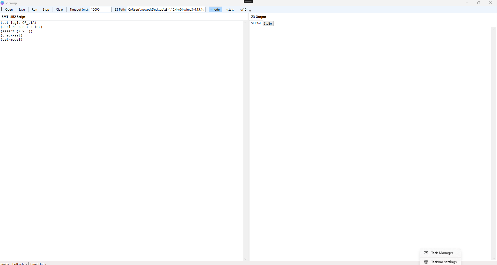

# Z3 GUI

**A lightweight, open-source Z3 GUI for Windows (WPF) with timeout control, live stdout/stderr view, and command-line wrapper in pure C#.**

* Visual SMT-LIB2 editor on the left
* Z3 output (stdout / stderr) on the right
* Toolbar to run, stop, save, open, and tweak flags
* Ships with a tiny `Z3Wrap` library you can reuse in your own .NET projects

> Target keywords (so people can find this):
> `Z3 GUI`, `Z3 front-end`, `Z3 solver UI`, `SMT-LIB2 editor`, `SMT2 GUI`, `Z3 wrapper C#`, `Z3 .NET`, `Run Z3 from C#`, `WPF Z3`, `sat solver gui`

---

## Contents

* [Screenshots / What it looks like](#screenshots--what-it-looks-like)
* [Features](#features)
* [Quick start (run the GUI)](#quick-start-run-the-gui)
* [How to use the app](#how-to-use-the-app)

  * [Writing a constraint problem](#writing-a-constraint-problem)
  * [Running Z3](#running-z3)
  * [Killing a run / timeouts](#killing-a-run--timeouts)
  * [Saving and loading SMT2 files](#saving-and-loading-smt2-files)
* [Project layout](#project-layout)
* [Library usage (call Z3 from your own C# code)](#library-usage-call-z3-from-your-own-c-code)
* [Why this exists](#why-this-exists)
* [License / credits](#license--credits)
* [Need help / contracting](#need-help--contracting)

---

## Screenshots / What it looks like

**Main window layout (Z3GUI / Z3WrapApp):**

* Top: toolbar (Open, Save, Run, Stop, Clear, Timeout, Z3 path, flags like `-model`, `-stats`)
* Bottom: status bar with `ExitCode` and `TimedOut`
* Left pane: editable SMT-LIB2 script (QF_LIA, etc.)
* Right pane: two tabs

  * `StdOut` = solver result, model, stats, etc.
  * `StdErr` = warnings, errors, trace output

The UI is intentionally simple so you can just paste a formula, smash Run, and see `sat` / `unsat` / `model`.


---

## Features

### ✅ GUI for Z3 on Windows

* Edit SMT-LIB2 text in a resizable pane.
* Run Z3 directly, no command prompt required.
* See solver `stdout` and `stderr` separately.

### ✅ Timeout + Cancel

* You can:

  * Set a timeout (ms) before launch. If Z3 runs longer than that, it's killed.
  * Hit **Stop** to cancel mid-run.

This prevents “oops I wrote an NP-hard monster and my laptop is melting.”

### ✅ Flags / common options

From the toolbar you can toggle:

* `-model` → ask Z3 to print a model for `sat`
* `-stats` → ask Z3 to print statistics about the solve
* `-v:10` → increase verbosity

The base CLI call is:

```text
z3 -smt2 -in [maybe -model] [maybe -stats] [maybe -v:10]
```

### ✅ Choose Z3 binary

* Point directly at `z3.exe` (for example a local build or nightly)
* Or leave blank and it will try `z3` on your PATH

### ✅ Reusable C# wrapper (Z3Wrap)

`Z3Wrap` is a tiny .NET 9 library that:

* starts `z3.exe`
* streams your SMT2 text into stdin
* captures stdout/stderr
* enforces timeout with `CancellationToken`
* returns a clean result object: exit code, StdOut, StdErr, TimedOut

If you just want “run this SMT2 and give me the model” from C#, you don't have to write any process plumbing.

---

## Quick start (run the GUI)

Requirements:

* Windows
* .NET 9 SDK
* Z3 binary (download Z3 for Windows from Microsoft Research / GitHub releases and unzip it somewhere so you have `z3.exe`)

Steps:

1. **Clone / open the solution**

   ```text
   git clone https://github.com/<you>/Z3GUI.git
   cd Z3GUI/src
   ```

2. **Open `Z3Wrap.sln` in Visual Studio 2022+**

   * The solution contains two projects:

     * `Z3Wrap` (class library)
     * `Z3WrapApp` (the WPF GUI)

3. **Build and run `Z3WrapApp`**

   * Set `Z3WrapApp` as Startup Project.
   * F5 / Start Debugging.

4. **Tell the app where Z3 lives**

   * In the toolbar there's a textbox labeled “Z3 Path:”.
   * Paste the full path to your `z3.exe`.
     Example:
     `C:\tools\z3\z3.exe`

   If you leave it blank, the app just calls `z3` and assumes it's on your PATH.

You should now see a sample SMT-LIB2 script in the left pane and “Ready.” in the status bar.

---

## How to use the app

### Writing a constraint problem

Left pane = plain SMT-LIB2. You can type or paste something like:

```lisp
(set-logic QF_LIA)
(declare-const x Int)
(assert (> x 3))
(check-sat)
(get-model)
```

The app starts with something like that pre-loaded so you can test instantly.

### Running Z3

1. (Optional) Flip on/off:

   * `-model`
   * `-stats`
   * `-v:10`

2. (Optional) Adjust `Timeout (ms)` in the toolbar. For example `10000` = 10 seconds.

3. Click **Run**.

What happens:

* The app builds the argument string (for example `-smt2 -in -model -stats`)
* It launches Z3 with those args
* It writes your SMT2 text to Z3’s stdin
* It waits for Z3 to exit or timeout

After completion:

* `StdOut` tab shows things like `sat` and the model.
* `StdErr` tab shows warnings or errors.
* Status bar shows:

  * `ExitCode` (0 is normal success),
  * `TimedOut` (True/False),
  * and high-level status (“Done.”, “Timed out.”, “Error.”, etc.).

### Killing a run / timeouts

There are two safety nets:

**Manual stop**

* Click **Stop**.
* Internally this triggers a `CancellationToken` → the process is killed.

**Automatic timeout**

* If Z3 doesn't finish within the timeout you set, the wrapper kills it.
* Status bar will show `TimedOut: True`.

This is useful for very hard queries or accidental infinite work.

### Saving and loading SMT2 files

* **Open**

  * Button: “Open”
  * Loads `.smt2` or any text file into the left pane.
* **Save**

  * Button: “Save”
  * Saves the current contents of the left pane to disk.

This is just normal UTF-8 text I/O.

### Clearing output

* **Clear** wipes:

  * StdOut
  * StdErr
  * ExitCode / TimedOut labels

---

## Project layout

```text
Z3GUI/
└─ src/
   ├─ Z3Wrap.sln           // Visual Studio solution
   │
   ├─ Z3Wrap/              // Library: C# wrapper around z3.exe
   │   ├─ Z3Wrap.csproj    // targets net9.0
   │   └─ Z3Cli.cs         // Z3Cli.RunScriptAsync(...)
   │
   └─ Z3WrapApp/           // WPF GUI (the actual "Z3 GUI")
       ├─ Z3WrapApp.csproj // targets net9.0-windows with <UseWPF>true</UseWPF>
       ├─ App.xaml / App.xaml.cs
       ├─ MainWindow.xaml
       └─ MainWindow.xaml.cs
```

### Z3Wrap (library)

`Z3Cli.RunScriptAsync(...)` signature:

```csharp
public static Task<Z3Cli.Result> RunScriptAsync(
    string script,
    string? z3Path = null,
    string extraArgs = "-smt2 -in",
    int timeoutMs = 0,
    CancellationToken ct = default
);
```

* `script`
  SMT-LIB2 text you want to send to Z3’s stdin.
* `z3Path`
  Full path to `z3.exe`, or `null` to just call `z3` from PATH.
* `extraArgs`
  Extra command-line flags, e.g. `"-smt2 -in -model -stats"`.
* `timeoutMs`
  0 = no timeout. Otherwise, kill the process after that many milliseconds.
* `ct`
  CancellationToken. Cancel it to abort early.

It returns:

```csharp
public record Result(
    int ExitCode,
    string StdOut,
    string StdErr,
    bool TimedOut
);
```

You get:

* `ExitCode` from the solver process (0 is usually "success")
* `StdOut` / `StdErr` captured fully
* `TimedOut` true if we killed it because of timeout/cancel

Also note:

* If `z3.exe` can’t be found or started, you get that error message in `StdErr`.
* If you cancel, `TimedOut` will be true and you’ll see partial output.

---

## Library usage (call Z3 from your own C# code)

You don’t have to use the GUI. You can reference `Z3Wrap` in any .NET 9 project and drive Z3 programmatically.

Example:

```csharp
using System;
using System.Threading;
using System.Threading.Tasks;
using Z3Wrap;

class Demo
{
    static async Task Main()
    {
        string smt = @"
(set-logic QF_LIA)
(declare-const x Int)
(assert (> x 3))
(check-sat)
(get-model)
";

        using var cts = new CancellationTokenSource();
        var result = await Z3Cli.RunScriptAsync(
            script: smt,
            z3Path: @"C:\tools\z3\z3.exe",   // or null if Z3 is on PATH
            extraArgs: "-smt2 -in -model",
            timeoutMs: 5000,
            ct: cts.Token
        );

        Console.WriteLine($"ExitCode: {result.ExitCode}");
        Console.WriteLine("=== STDOUT ===");
        Console.WriteLine(result.StdOut);
        Console.WriteLine("=== STDERR ===");
        Console.WriteLine(result.StdErr);
        Console.WriteLine($"TimedOut: {result.TimedOut}");
    }
}
```

This is nice for:

* unit tests that assert `sat` / `unsat`
* CI gates (“prove there’s no unsafe transition”)
* generating models to feed follow-up code

---

## Why this exists

Z3 is an insanely powerful SMT solver / SAT+SMT engine.
It answers questions like “is there any integer assignment that satisfies all these constraints?” and “give me an example model if it's satisfiable.”

But:

* Usually you run it from a terminal.
* You have to remember flags.
* You paste SMT-LIB2 into stdin manually.
* Killing a runaway solve = Task Manager.

**Z3GUI** (this repo) tries to make that loop nicer for:

* Constraint prototyping
* Teaching / demos
* Quickly checking satisfiable models
* Integrating Z3 into C#/.NET code without pulling in the heavier official API

This project does **not** wrap Z3's full native API / object model.
It’s literally: launch `z3.exe`, send text, get text. That’s on purpose:

* Works with any Z3 build
* No native interop headaches
* Easy to swap in nightly Z3 binaries
* Easy to reason about what Z3 actually received

---

## License / credits

* Code © 2025 Warren Harding.
* Solver `z3.exe` is **not** included. You must download Z3 separately from the official Z3 project (Microsoft Research).
* This repository is provided as-is with no warranty.
  You are responsible for verifying solver output before using it in safety-critical or security-critical systems.

If you redistribute or fork:

* Please keep the copyright notice in the source.
* Please don’t present this tool as an official Microsoft/Z3 UI — it’s not.

---

## Need help / contracting

I provide C# and SQL code generation / automation work:

“10x coder == 1/10 cost.”

Estimates and contact: TranscendAI.tech

---

© 2025 Warren Harding — TranscendAI.tech — MyndSprout


